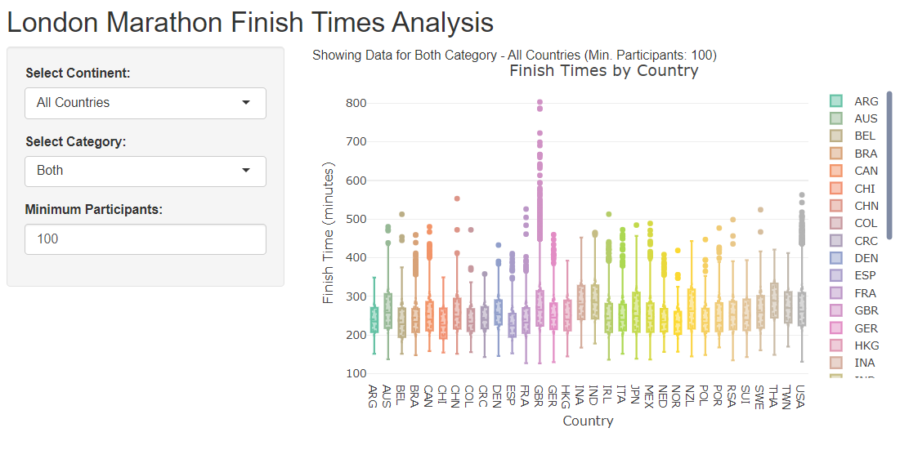
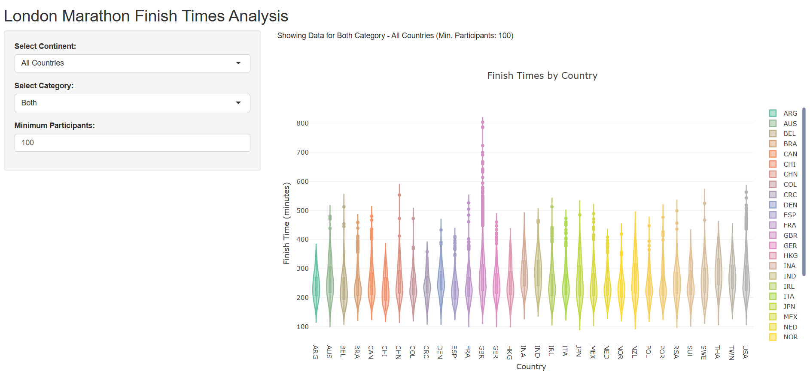

```{r setup, include=FALSE}
knitr::opts_chunk$set(echo = TRUE, message=FALSE, warning=FALSE)
```

# **Introduction and Research Question**

The London Marathon is one of the most popular marathons worldwide, and makes up one of the big 6. Participants come from all across the world to compete, whether it be within the Elite group or the Mass group. With so many countries involved, this project looks to answer the question: How did each country perform at the London Marathon 2024? It will look to provide insight into each countries average finish time, the distribution of times, the fastest time, the slowest time, and many other interpretations.

# **Loading Packages**

First we must check the packages are installed to the devices library folder, ensuring any that aren't get installed. These must then be loaded

```{r} 
# A loop to install all the listed packages if needed
packages <- c("shiny", "plotly", "rvest", "tidyverse", "countrycode", "rsconnect")
for (i in packages) {
  if (!require(i, character.only = TRUE)) install.packages(i)
}

# Load necessary libraries
library(shiny)
library(plotly)
library(rvest)
library(tidyverse)
library(countrycode)
library(rsconnect)
```


# **Obtaining and Cleaning Data**

The data was obtained via scraping the London Marathon 2024 results page: (link?)
Initially a data frame was created to save the data to, and a function was created to scrape the different URLs. This function removed unneeded aspects of the data, for example the country code was in the same data point as the participants name and thus the name had to be removed. It also had to remove the top line of the data pulled through as it included the column headers. Finally, certain participants did not have a country code and thus needed to removed from the data frame.

```{r}
# Initialize final results data frame
final_results <- data.frame(Country = character(), Time = character(), Category = character(), stringsAsFactors = FALSE)

# Function to scrape data from a given URL
scrape_results <- function(url, category) {
  page <- read_html(url)
  
  # Extract country codes
  country <- page %>% html_nodes(".type-fullname") %>% html_text()
  country <- gsub(".*\\(([^)]+)\\)", "\\1", country)
  country <- country[-1]
  
  # Extract finish times
  finish_time <- page %>% html_nodes(".pull-right .type-time") %>% html_text()
  finish_time <- gsub("^Finish", "", finish_time)
  finish_time <- finish_time[-1]
  
  # Filter valid countries (ISO-3166-1 alpha-3 codes)
  valid_countries <- grepl("^[A-Z]{3}$", country)
  country <- country[valid_countries]
  finish_time <- finish_time[valid_countries]
  
  # Return as a data frame
  return(data.frame(Country = country, Time = finish_time, Category = category, stringsAsFactors = FALSE))
}
```

The function was then used to scrape the data from the results page for the participants in the mass race and participants in the elite race. 
The mass race with the maximum participants (1000) per page had 54 pages of results, this required a for loop to work through each page. To create a unique URL for the elite results it required having multiple pages. Therefore, 25 participants per page was used and a loop created to scrape the 2 pages. Sense checks were added to the scraping of each URL to show that the process was still ongoing, because the 54 page loop takes some time and could appear to be frozen.

```{r}
# Scrape Mass participants (54 pages with 1000 participants each)
cat("Starting to scrape Mass participants...\n")
for (page_result in seq(from = 1, to = 54, by = 1)) {
  mass_url <- paste0("https://results.tcslondonmarathon.com/2024/?page=", 
                     page_result, "&event=MAS&num_results=1000&pid=search&pidp=start&search%5Bsex%5D=%25&search%5Bage_class%5D=%25&search%5Bnation%5D=%25&search_sort=place_nosex")
  
  mass_data <- scrape_results(mass_url, "Mass")
  
  # Sense check: Output for each page
  cat(sprintf("Scraped %d rows for Mass - Page %d/54\n", nrow(mass_data), page_result))
  
  final_results <- rbind(final_results, mass_data)
}

# Scrape Elite participants (2 pages with 25 participants each)
cat("Starting to scrape Elite participants...\n")
for (page_result in seq(from = 1, to = 2, by = 1)) {
  elite_url <- paste0("https://results.tcslondonmarathon.com/2024/?page=", 
                      page_result,"&event=ELIT&pid=search&pidp=start&search%5Bsex%5D=%25&search%5Bage_class%5D=%25&search%5Bnation%5D=%25&search_sort=place_nosex")
  
  elite_data <- scrape_results(elite_url, "Elite")
  
  # Sense check: Output for each page
  cat(sprintf("Scraped %d rows for Elite - Page %d/2\n", nrow(elite_data), page_result))
  
  final_results <- rbind(final_results, elite_data)
}
```

The data for the finish time then needed to be converted into time in minutes to allow for better plotting

```{r}
# Convert 'Time' column to total minutes
final_results$Time <- sapply(strsplit(final_results$Time, ":"), function(x) {
  as.numeric(x[1]) * 60 + as.numeric(x[2]) + as.numeric(x[3]) / 60
})
```

A sense check was then run to check the data was scraped correctly.
We would expect: 53,875 rows, 4 columns, and 152 countries

```{r}
# SENSE CHECK: Verify data after scraping
cat("Data scraping complete. Final dataset has:\n")
cat(sprintf("%d rows and %d columns\n", nrow(final_results), ncol(final_results)))
cat(sprintf("Unique countries: %d\n", length(unique(final_results$Country))))
```

The participants per country was counted; this allowed for a min participants filter

```{r}
# Counting participants per country
final_results$Country <- as.character(final_results$Country)
country_counts <- table(final_results$Country)
country_counts_df <- as.data.frame(country_counts)
colnames(country_counts_df) <- c("Country", "Count")
```


A column was added for continents and the country codes mapped to their relevant continent. This was done automatically for many of the countries via countrycode. However, the formatting of some of the country codes by London Marathon was incorrect, these countries had to manually have their continents mapped. This was to allow for the plot to select by continent.

```{r}
# Function to assign continents with manual overrides
assign_continents <- function(country_codes) {
  # Base continent mapping using countrycode
  country_continent_mapping <- countrycode(
    sourcevar = country_codes,
    origin = "iso3c",
    destination = "continent"
  )
  

  # Manual overrides for specific countries
  manual_overrides <- c(
    "ALG" = "Africa",
    "ANT" = "Americas", "ARU" = "Americas", "BAH" = "Americas", "BAR" = "Americas",
    "BER" = "Americas", "BIZ" = "Americas", "CAY" = "Americas", "CHA" = "Africa",
    "CHI" = "Europe", "CRC" = "Americas", "CRO" = "Europe", "DEN" = "Europe",
    "ESA" = "Americas", "GAM" = "Africa", "GER" = "Europe", "GRE" = "Europe",
    "GRN" = "Americas", "GUA" = "Americas", "HAI" = "Americas", "HON" = "Americas",
    "INA" = "Asia", "IRI" = "Asia", "ISV" = "Americas", "IVB" = "Americas",
    "KSA" = "Asia", "KUW" = "Asia", "LAT" = "Europe", "LBA" = "Africa",
    "LES" = "Africa", "LIB" = "Africa", "MAD" = "Africa", "MAS" = "Asia",
    "MGL" = "Asia", "MRI" = "Africa", "MYA" = "Asia", "NCA" = "Americas",
    "NED" = "Europe", "NEP" = "Asia", "NGR" = "Africa", "PAR" = "Americas",
    "PHI" = "Asia", "PLE" = "Asia", "POR" = "Europe", "PUR" = "Americas",
    "RSA" = "Africa", "SIN" = "Asia", "SLO" = "Europe", "SRI" = "Asia",
    "SUD" = "Africa", "SUI" = "Europe", "TAN" = "Africa", "TRI" = "Americas",
    "UAE" = "Asia", "URU" = "Americas", "VIE" = "Asia", "VIN" = "Americas",
    "ZAM" = "Africa", "ZIM" = "Africa", "BRU" = "Asia", "BHU" = "Asia", "BAN" = "Asia", "CAM" = "Africa", "BUL" = "Europe"
  )
  
  # Apply manual overrides
  country_continent_mapping <- ifelse(
    !is.na(manual_overrides[country_codes]),
    manual_overrides[country_codes],
    country_continent_mapping
  )
  
  # Replace any remaining NA values with "Other"
  country_continent_mapping[is.na(country_continent_mapping)] <- "Other"
  
  return(country_continent_mapping)
}

# Assigning the continents within the data frame
final_results$Continent <- assign_continents(final_results$Country)

```

A sense check was run to ensure no errors in the data

```{r}
# SENSE CHECK: Verify continent mapping
cat("Continent mapping complete. Summary:\n")
print(summary(final_results$Continent))

# Additional SENSE CHECK: Check for any "Other" values in the Continent column
other_continents <- sum(final_results$Continent == "Other")
cat("\nNumber of 'Other' continents found: ", other_continents, "\n")

if (other_continents > 0) {
  cat("Warning: There are 'Other' entries in the Continent column. Please check the country codes and mapping.\n")
} else {
  cat("No 'Other' entries found in the Continent column. Data looks good.\n")
}

```

The data was saved. A sense check also occurred to view the top 5 lines of data to ensure no errors occurred. We should expect these top 5 rows to be populated with the same data as the top 5 rows of the [London Marathon Mass event](https://results.tcslondonmarathon.com/2024/?page=1&event=MAS&num_results=1000&pid=search&pidp=start&search%5Bsex%5D=%25&search%5Bage_class%5D=%25&search%5Bnation%5D=%25&search_sort=place_nosex)

```{r}
output_file <- "data/final_results.csv"

write.csv(final_results, output_file, row.names = FALSE)
cat(sprintf("Data saved successfully to '%s'\n", output_file))

# Perform a sense check: Display the top 5 rows
cat("Displaying the top 5 rows of the final_results dataframe:\n")
print(head(final_results, 5))
```


# **Creating the Visualisation**

Initially the user interface for the interactive plot must be defined

```{r}
# UI for the Shiny app
ui <- fluidPage(
  titlePanel("London Marathon Finish Times Analysis"),
  
  sidebarLayout(
    sidebarPanel(
      selectInput("continent_filter", "Select Continent:",
                  choices = c("All Countries", "Top 5 Countries by Participants", unique(final_results$Continent)),
                  selected = "All Countries"),
      selectInput("category_filter", "Select Category:",
                  choices = c("Both", "Elite", "Mass"), 
                  selected = "Both"),
      numericInput("min_participants", "Minimum Participants:", 
                   value = 100, min = 1, step = 1) # Added numeric input for minimum participants
    ),
    mainPanel(
      textOutput("dynamic_title"), # Added dynamic title
      plotlyOutput("boxplot")
    )
  )
)
```

## *Initial Visualisation*
Initially, I planned to make an interactive plot that would allow you to select for different factors such as event type, continent and min participants. To achieve this i created an interactive box plot. This visualisation is shown as a png.
(here we can also see a function being created for filtering the data within the plot)

```{r}
# Server logic for the Shiny app
server <- function(input, output) {
  
  # Reactive filtered data based on user inputs
  filtered_data <- reactive({
    data <- final_results
    
    # Filter by continent
    if (input$continent_filter == "All Countries") {
      data <- data
    } else if (input$continent_filter == "Top 5 Countries by Participants") {
      top_countries <- country_counts_df %>%
        arrange(desc(Count)) %>%
        head(5) %>%
        pull(Country)
      data <- data %>% filter(Country %in% top_countries)
    } else {
      data <- data %>% filter(Continent == input$continent_filter)
    }
    
    # Filter by category
    if (input$category_filter != "Both") {
      category <- input$category_filter
      data <- data %>% filter(Category == category)
    }
    
    # Filter by minimum participants
    min_participants <- input$min_participants
    country_filter <- country_counts_df %>%
      filter(Count >= min_participants) %>%
      pull(Country)
    data <- data %>% filter(Country %in% country_filter)
    
    return(data)
  })
  
  # Dynamic title based on filters
  output$dynamic_title <- renderText({
    title <- paste(input$category_filter, "Category -", input$continent_filter)
    title <- paste(title, sprintf("(Min. Participants: %d)", input$min_participants))
    paste("Showing Data for", title)
  })
# Render boxplot
  output$boxplot <- renderPlotly({
    data <- filtered_data()
    
    plot_ly(data, 
            y = ~Time, 
            color = ~Country, 
            type = "box", 
            boxmean = "sd") %>%
      layout(
        title = paste("Finish Times by Country"),
        xaxis = list(title = "Country"),
        yaxis = list(title = "Finish Time (minutes)")
      )
  })
}


```

## *Final Visualisation*

However, I believe a violin plot better demonstrates the distribution of times. It allows for a clearer visual on the common times for the country. Whilst the exact mean, min and max are not as clear as with the box plot, the interactive properties of the graph allow for this data to be acquired easily, whilst still allowing for a clear visualisation of distribution. Shown below is a screenshot of the plot, click the link below this code to take you to the interactive plot.

```{r}
# UI for the Shiny app
ui <- fluidPage(
  titlePanel("London Marathon Finish Times Analysis"),
  
  sidebarLayout(
    sidebarPanel(
      selectInput("continent_filter", "Select Continent:",
                  choices = c("All Countries", "Top 5 Countries by Participants", unique(final_results$Continent)),
                  selected = "All Countries"),
      selectInput("category_filter", "Select Category:",
                  choices = c("Both", "Elite", "Mass"), 
                  selected = "Both"),
      numericInput("min_participants", "Minimum Participants:", 
                   value = 100, min = 1, step = 1) # Added numeric input for minimum participants
    ),
    mainPanel(
      textOutput("dynamic_title"), # Added dynamic title
      br(),  # Add a line break for extra space
      plotlyOutput("boxplot", height = "600px") # Set height to ensure plot is appropriately sized
    )
  )
)

# Server logic for the Shiny app
server <- function(input, output) {
  
  # Reactive filtered data based on user inputs
  filtered_data <- reactive({
    data <- final_results
    
    # Filter by continent
    if (input$continent_filter == "All Countries") {
      data <- data
    } else if (input$continent_filter == "Top 5 Countries by Participants") {
      top_countries <- country_counts_df %>%
        arrange(desc(Count)) %>%
        head(5) %>%
        pull(Country)
      data <- data %>% filter(Country %in% top_countries)
    } else {
      data <- data %>% filter(Continent == input$continent_filter)
    }
    
    # Filter by category
    if (input$category_filter != "Both") {
      category <- input$category_filter
      data <- data %>% filter(Category == category)
    }
    
    # Filter by minimum participants
    min_participants <- input$min_participants
    country_filter <- country_counts_df %>%
      filter(Count >= min_participants) %>%
      pull(Country)
    data <- data %>% filter(Country %in% country_filter)
    
    return(data)
  })
  
  # Dynamic title based on filters
  output$dynamic_title <- renderText({
    title <- paste(input$category_filter, "Category -", input$continent_filter)
    title <- paste(title, sprintf("(Min. Participants: %d)", input$min_participants))
    paste("Showing Data for", title)
  })
  
  # Render violin plot
  output$boxplot <- renderPlotly({
    data <- filtered_data()
    
    plot_ly(data,
            y = ~Time,
            color = ~Country,
            type = "violin",  # Change type to "violin" for violin plot
            box = list(visible = TRUE)) %>%  # Add box option for better comparison
      layout(
        title = paste("Finish Times by Country"),
        xaxis = list(title = "Country"),
        yaxis = list(title = "Finish Time (minutes)"),
        margin = list(t = 100)  # Add top margin to push plot down
      )
  })
}


```


**To view the interactive plot click [Here](https://tomok246.shinyapps.io/Marathon-Times-by-Country/)**


## *Alternative Visualisation*

An alternative visualisation would be to create an overlay of the box plot and the violin plot, this would therefore allow for an immediate viewing of both the distribution of times and the mean, min and max times. However, this plot would not be interactive and would therefore require selecting countries from those included. The example code below creates the plot for the countries with the top 10 participants. This plot would be used in a visualisation where links could not be clicked to access the interactive plot.

```{r}
#visualisation 3

# Sort countries by the number of participants in descending order
top_10_countries <- head(country_counts_df[order(-country_counts_df$Count), ], 10)

# Filter final_results to include only these top 10 countries
top_10_data <- final_results[final_results$Country %in% top_10_countries$Country, ]

#Plot a graph with the top 10 countries

p <- ggplot(top_10_data, aes(x = Country, y = Time, fill = Country)) +
  
  # Violin plot
  geom_violin(alpha = 0.5, position = position_dodge(width = 0.75), trim = TRUE) +
  
  # Boxplot overlay
  geom_boxplot(width = 0.2, position = position_dodge(width = 0.75), 
               alpha = 0.8, outlier.shape = NA, color = "black") +
  
  # Add plot title and axis labels
  ggtitle("Finish Time Distribution for Top 10 Countries") +
  xlab("Country") + 
  ylab("Finish Time (minutes)") +
  
  # Customize appearance
  theme_minimal() +
  theme(axis.title.x = element_text(size = 12), 
        axis.title.y = element_text(size = 12), 
        plot.title = element_text(hjust = 0.5, size = 14, face = "bold"),
        axis.text.x = element_text(size = 10, angle = 45, hjust = 1),
        axis.text.y = element_text(size = 10)) +
  
  # Color customization (assign different colors for each country)
  scale_fill_manual(values = RColorBrewer::brewer.pal(10, "Set3"))  # Using a color palette for top 10 countries


#Save plot and export as jpeg
ggsave(
  filename = "./figs/Top_10_Countries_Finish_Time_Distribution.jpeg",
  plot = p,
  dpi = 1200,
  width = 180,
  height = 170,
  units = "mm"
)

#sense check to show the plot is saved
cat("Plot saved successfully.\n")

#display the plot
p
```

# *Discussion*

From the final visualisation, the interactive violin plot reveals a wealth of insights. For the countries with the top 5 participants, we observe that France has the lowest average finish time, the UK has the fastest time, and Italy shows the most consistent distribution, as indicated by its relatively even kernel shape compared to the others. In the Elite category, the plot is particularly interesting due to the Kenyan victory. While Kenya has the fastest time, its distribution is noticeably skewed toward higher values. Lastly, among countries with at least 600 participants, France stands out with a short, wide kernel, indicating the greatest consistency in finish times. Overall, the plot offers a range of interpretations, providing valuable insights into each country’s performance at the London Marathon 2024.

# *Limitations*

A key limitation to this is that the data is scraped from the London marathon, and therefore we expect a higher proportion of participants from the UK. Furthermore, the London marathon requires a qualifying time to have previously been achieve (you can also gain entry through charities, hence the number of participants with slower times), this means that the participants are on average better runners than most marathon participants. To mitigate these limitations, it would require scraping and collating data from a number of marathons throughout the year, including those without qualifying times and a higher acceptance rate.


